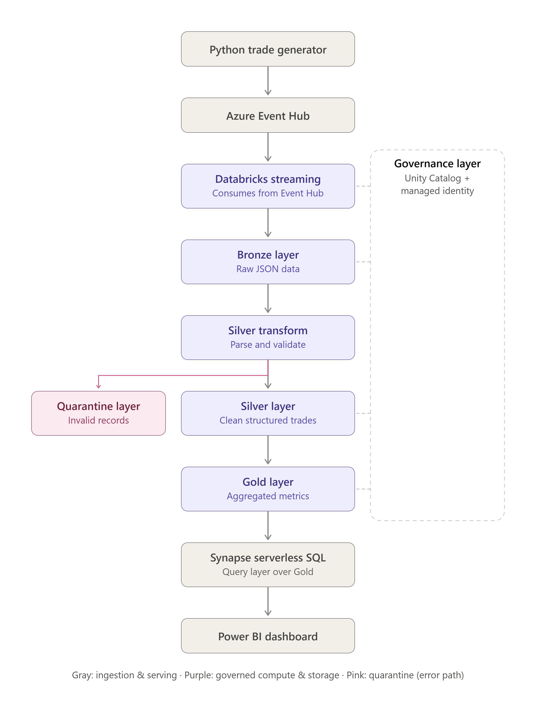
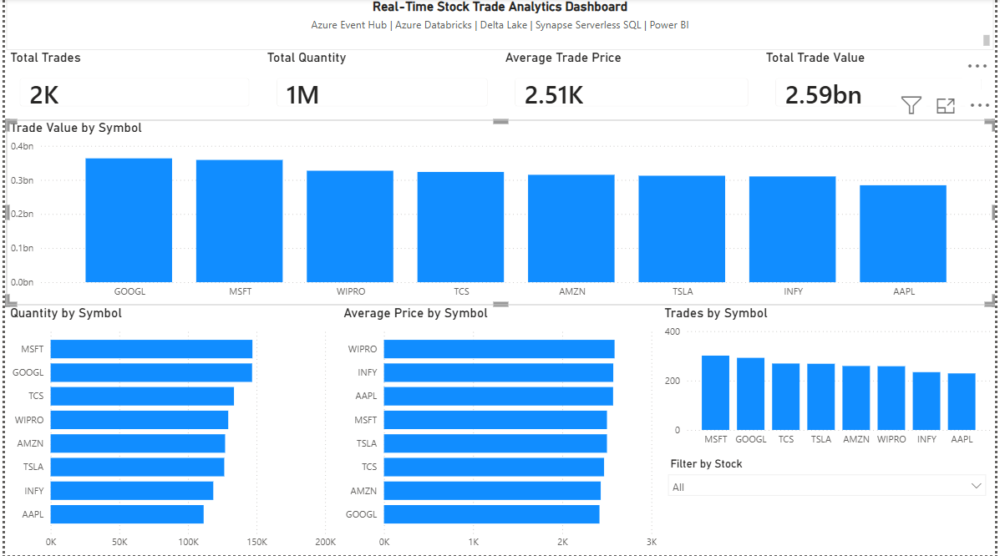

# 🚀 Azure Real-Time Stock Trade Analytics Pipeline


An end-to-end Azure Data Engineering project demonstrating **real-time stock trade ingestion, Delta Lake Medallion Architecture, Azure Synapse Serverless SQL, and interactive Power BI reporting.**

---

# 📌 Project Overview

This project simulates a real-time stock trading system using Microsoft Azure services.

It demonstrates how streaming data can be ingested, processed, validated, aggregated, queried, and visualized using a modern cloud-native data engineering architecture.

The solution implements:

- Real-time streaming data ingestion
- Delta Lake Medallion Architecture
- Data quality validation
- Quarantine layer for invalid records
- Serverless SQL analytics
- Interactive Power BI dashboard

---

# 🎯 Business Problem

Modern stock exchanges generate thousands of trade events every second.

Business users require real-time insights such as:

- Which stock has the highest trade value?
- Which stocks are traded most frequently?
- What is the average trade price?
- How many shares were traded?
- Which records failed validation?

This project builds a scalable analytics pipeline capable of answering these questions using Azure's cloud-native services.

---

# 🏗 Solution Architecture



---

# ☁ Technology Stack

| Layer | Technology |
|--------|------------|
| Programming | Python |
| Streaming | Azure Event Hub |
| Processing | Azure Databricks |
| Framework | Apache Spark Structured Streaming |
| Storage | Azure Data Lake Storage Gen2 |
| Storage Format | Delta Lake |
| Analytics | Azure Synapse Serverless SQL |
| Reporting | Microsoft Power BI |
| Version Control | Git & GitHub |

---

# 📂 Repository Structure

```text
Azure-RealTime-Trade-Analytics
│
├── architecture/
│     trade_data_pipeline_architecture.png
│
├── databricks/
│     01_Bronze_Ingestion
│     02_Silver_Transformation
│     03_Gold_Aggregation
│
├── sql/
│     04_Synapse_Serverless_SQL.sql
│
├── powerbi/
│     Real-Time Stock Trade Analytics Dashboard.pbix
│     README.md
│
├── screenshots/
│     Bronze_Delta_Data.png
│     Silver_Delta_Data.png
│     Gold_Delta_Data.png
│     PowerBI_Dashboard.png
│     ...
│
├── docs/
│     Important_Learning.md
│     Challenges_and_Solutions.md
│     Setup_Guide.md
│
├── config_template.py
├── trade_event_producer.py
├── README.md
└── .gitignore
```

---

# 🔄 End-to-End Workflow

1. Python generates simulated stock trade events.
2. Trade events are streamed into Azure Event Hub.
3. Azure Databricks consumes the stream using Structured Streaming.
4. Raw data is stored in the Bronze Delta Layer.
5. Silver Layer performs validation, cleansing, and schema enforcement.
6. Invalid records are written to the Quarantine Layer.
7. Gold Layer generates business-ready aggregated datasets.
8. Azure Synapse Serverless SQL queries Delta Lake directly.
9. Power BI connects to Synapse SQL Views for reporting.

---

# 🥉 Bronze Layer

### Purpose

Store incoming trade events exactly as received.

### Responsibilities

- Raw event ingestion
- Immutable storage
- Historical data preservation
- Delta format storage

---

# 🥈 Silver Layer

### Purpose

Clean and validate incoming streaming data.

### Transformations

- Parse JSON
- Validate schema
- Remove invalid records
- Standardize columns
- Apply business validation rules

---

# 🚫 Quarantine Layer

Invalid records are redirected into a separate Delta table instead of being discarded.

### Benefits

- Prevents data loss
- Improves data quality
- Simplifies debugging
- Supports auditing and monitoring

---

# 🥇 Gold Layer

The Gold Layer stores business-ready aggregated datasets optimized for analytics.

### Metrics Generated

- Total Trades
- Total Quantity
- Average Trade Price
- Total Trade Value

---

# 🗄 Azure Synapse Serverless SQL

Created Analytics Database

```sql
trade_analytics
```

## SQL Views

### vw_trade_summary

Business-level aggregated trade metrics.

Columns

- symbol
- total_trades
- total_quantity
- average_price
- total_trade_value
- gold_processed_time

---

### vw_dashboard_summary

Dashboard KPI summary.

Columns

- total_trades
- total_quantity
- average_trade_price
- total_trade_value

---

# 📊 Power BI Dashboard

The dashboard connects directly to Azure Synapse Serverless SQL Views.

Business logic is implemented within Synapse SQL rather than Power BI, ensuring centralized data processing.

### KPI Cards

- Total Trades
- Total Quantity
- Average Trade Price
- Total Trade Value

### Visualizations

- Trade Value by Symbol
- Quantity by Symbol
- Average Price by Symbol
- Trades by Symbol

### Interactive Filter

- Stock Symbol Slicer

---

# 📷 Dashboard Screenshots

## Solution Architecture


---

## Power BI Dashboard



---

# ⚠ Challenges Faced

## Schema Validation Issues

**Problem**

Incoming streaming events contained inconsistent data types.

**Solution**

Implemented explicit Spark schema definitions and validation before writing to Delta Lake.

---

## Invalid Records

**Problem**

Streaming data contained malformed records.

**Solution**

Implemented a Quarantine Layer to isolate invalid records without affecting downstream processing.

---

## Synapse Credential Error

**Problem**

Serverless SQL failed while accessing Delta Lake.

**Solution**

Created a Database Master Key to securely access external Delta files.

---

## Power BI Authentication

**Problem**

Power BI authentication failed while connecting to Synapse.

**Solution**

Configured SQL Authentication using Synapse SQL Administrator credentials.

---

# 📚 Key Learnings

- Azure Event Hub Streaming
- Apache Spark Structured Streaming
- Delta Lake Medallion Architecture
- Data Validation
- Quarantine Layer Design
- Azure Synapse Serverless SQL
- Database Master Key
- Power BI Reporting
- End-to-End Azure Data Engineering Pipeline

---

# 🚀 Future Enhancements

- Azure Data Factory Orchestration
- Unity Catalog
- Azure Key Vault Integration
- CI/CD using Azure DevOps
- GitHub Actions
- Azure Monitor Alerts
- Data Quality Dashboard
- Machine Learning Predictions

---

# ▶ How to Run

1. Create Azure Storage Account.
2. Create Azure Event Hub.
3. Deploy Azure Databricks.
4. Run Bronze Notebook.
5. Run Silver Notebook.
6. Run Gold Notebook.
7. Create Azure Synapse Workspace.
8. Execute Synapse SQL Script.
9. Connect Microsoft Power BI.
10. Refresh Dashboard.

---

# 💼 Skills Demonstrated

## Azure Services

- Azure Event Hub
- Azure Databricks
- Azure Data Lake Storage Gen2
- Azure Synapse Analytics

## Data Engineering

- Apache Spark
- Structured Streaming
- Delta Lake
- Medallion Architecture
- ETL Pipeline Development
- Data Validation
- Data Quality

## Programming

- Python
- SQL

## Visualization

- Microsoft Power BI

## Version Control

- Git
- GitHub

---

# 👨‍💻 Author

**Nitish Sarkar**

Azure Data Engineering Enthusiast

**GitHub**

https://github.com/nsg26

**LinkedIn**

https://www.linkedin.com/in/YOUR-LINKEDIN-PROFILE

---

# ⭐ Support

If you found this project useful, please consider giving it a ⭐ on GitHub.
